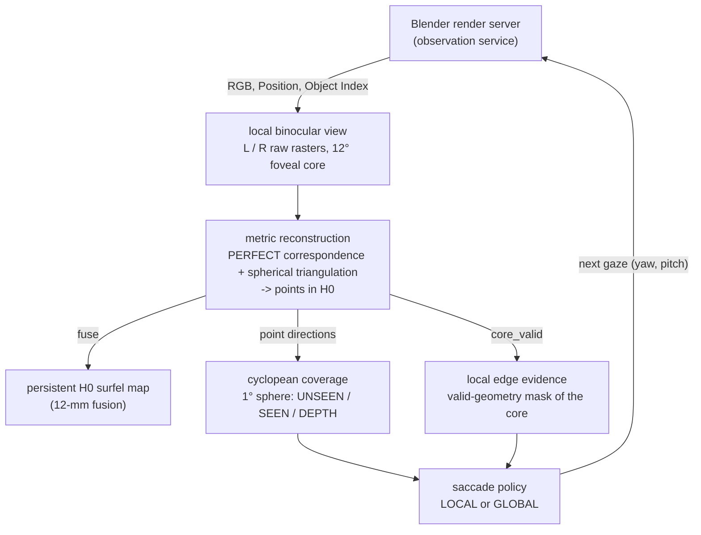
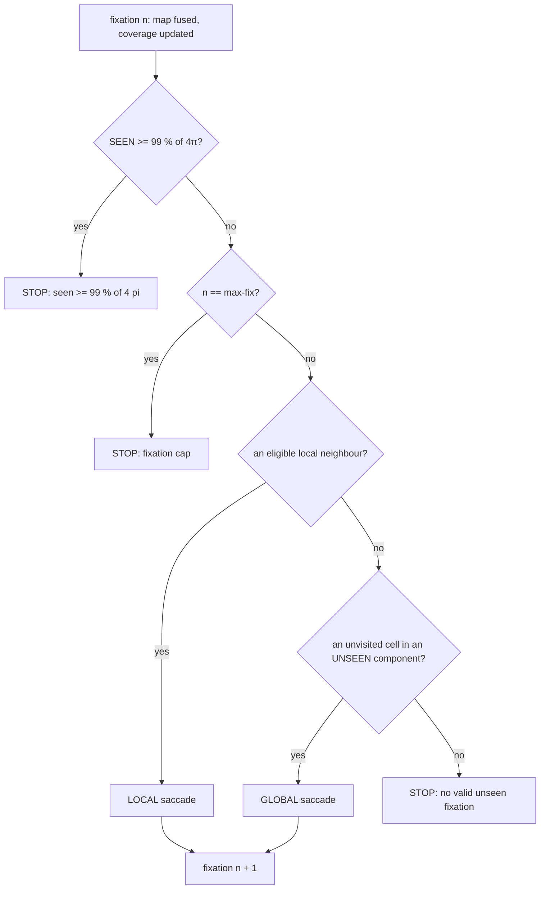

# Greedy Foveal Playground — architecture

This is the architecture reference for the **Greedy Foveal Explorer**, the official baseline of the active-foveal
playground. Code: [`tools/greedy_foveal/`](../../tools/greedy_foveal/README.md). Officialization step:
[Engineering-1 contract](../engineering/greedy-foveal-playground-baseline-contract.md).

You can read this document without the project's historical controller work. Each number is labelled as MEASURED
(with its run) or as a parameter.

---

## 1. Purpose

The playground answers one question with as little machinery as possible:

> Can a pair of foveated eyes on a fixed head reconstruct a whole 360° scene by looking around, one fixation at a time,
> using only what it has measured so far to decide where to look next?

The baseline does this in the Blender **Classroom** scene. It is deliberately small, five source files, so that each
component can be swapped out and compared against a frozen, reproducible reference run.

What it is: a research / engineering playground, and a known-good baseline for comparisons.
What it is not: a general vision system, a framework, or an optimal exploration strategy.

## 2. Design principle

    FIXATE -> RECONSTRUCT EVERYTHING LOCALLY -> UPDATE GLOBAL H0 MAP + CYCLOPEAN COVERAGE
           -> LOCAL OR GLOBAL SACCADE -> REPEAT

1. **Fixate.** Point both eyes at a gaze direction. The head never moves.
2. **Reconstruct everything locally.** Every pixel of the 12° foveal core that can be matched between the eyes becomes
   a metric 3-D point. There is no object selection and no region of interest inside the fovea.
3. **Update memory.** Fuse the points into **one** global surfel map in the fixed head frame H0. Mark the gaze's
   footprint on a coarse sphere as SEEN, and as DEPTH where points landed.
4. **Saccade.** If the fovea's edge still shows geometry in the direction of an unexplored neighbour, step there
   (local). Otherwise jump to the middle of the largest unexplored region (global).
5. **Repeat** until 99 % of the sphere has been seen.

Only four pieces of state cross from one fixation to the next: the map, the coverage sphere, the list of visited gaze
directions and the current gaze. There is no object scheduler, no per-object state and no controller state machine.

## 3. System context



How to read the diagram:

- The **render server** is the only thing that touches the scene. Given a gaze, it returns a binocular observation:
  two 640 × 640 raw images per fixation. Each one holds RGB plus the Blender Position and Object Index passes.
- **Reconstruction** turns the central 256 × 256 foveal core of the left eye into metric points in H0. It uses
  PERFECT / ORACLE correspondence (section 7) and the accepted spherical epipolar triangulation.
- The points feed three things. The **persistent map** keeps them, fused at 12 mm. The **coverage sphere** records
  which directions have been looked at and which got depth. The **edge evidence** is a 256 × 256 mask of the core
  pixels that produced a valid point.
- The **policy** reads only the coverage sphere, the current edge evidence and the visited list. It chooses the next
  gaze.

**An architectural fact to keep in mind.** In this baseline the global map is **written but never read during
control**. Coverage and edge evidence are computed from the *current fixation's* points, not by querying the map. The
map is the product of the run; the coverage sphere is the controller's memory. A future experiment can close the loop
through the map (section 16).

## 4. Persistent state

| state | code | type / shape | meaning | updated |
|---|---|---|---|---|
| global surfel map **M** | `explorer.GlobalMap` | arrays: `xyz` (N, 3) float64 in H0 (m), `rgb` (N, 3) float64, `inst` int32, `support` int32, `first_fix` int32, `patch_ids` list | every reconstructed surface element so far | `GlobalMap.fuse`, once per fixation |
| coverage **S** | `state` in `run.explore` | int8 array (180, 360), values `UNSEEN 0`, `SEEN 1`, `DEPTH 2` | `S_seen = state >= 1`, `S_depth = state == 2` on the 1° cyclopean sphere | `explorer.update_coverage`; values never decrease |
| visited gazes | `visited` | (n, 3) unit vectors in H0 | every fixation direction so far | appended once per fixation |
| fixation trajectory | `traj` | list of per-fixation records | gaze, how it was chosen, counts, timings | appended once per fixation |
| current gaze | `yaw, pitch` | degrees in H0 | where the eyes point now | set by the decision |

Nothing else persists. The eye images, the correspondences, the triangulated points (except as saved
`points.npz` records), the core-valid mask and the tangent frame are rebuilt at every fixation and then discarded.

## 5. One fixation

```mermaid
sequenceDiagram
    participant H as run.explore (host)
    participant S as render_server (Blender)
    participant X as explorer (host)
    H->>S: QUEUE/req-NNNN.json {n, yaw, pitch, out_dir}
    S->>S: eye calibration for (yaw, pitch), fixed head; render L and R (Cycles, 64 spp)
    S-->>H: calibration.json, raw_L.exr, raw_R.exr, then QUEUE/done-NNNN.json
    H->>H: check: head pose unchanged, rendered gaze == requested gaze
    H->>X: load_observation -> reconstruct (PERFECT correspondence + spherical triangulation)
    X-->>H: xyz (H0), rgb, oracle id, core_valid, counts
    H->>X: GlobalMap.fuse (12 mm)
    H->>X: update_coverage, fractions
    H->>X: decide (unless a stop condition holds)
    X-->>H: LOCAL / GLOBAL next gaze, or NONE
```

Step by step, for fixation *n* at gaze (yaw, pitch):

1. **Gaze.** The cyclopean gaze direction in H0 is
   `d = (sin yaw · cos pitch, sin pitch, −cos yaw · cos pitch)`. The first gaze is (0°, 0°), straight ahead.
2. **Binocular render.** `run.Server.render` writes a request file. `render_server.py` builds the accepted eye
   calibration. The two eyes sit at ±31.5 mm on the head X axis (63 mm baseline) and verge on the point 2.1 m along
   the gaze. Each eye's raw raster is 640 × 640 px, focal 1217.84 px (29.4° field of view). Both eyes are rendered
   (Cycles OPTIX, 64 spp, box filter, no denoising, fixed seeds L 2111 / R 2112) into uncompressed multilayer EXRs with
   Combined, Position and Object Index.
3. **PERFECT correspondence.** `explorer.perfect_correspondence` is applied to the left eye's nominal core: raw pixels
   192..447 in x and y, which is 65,536 pixel centres covering about 12°. For each pixel it finds the exact matching
   position in the right image (section 7). The output is a list of `(left pixel, right sub-pixel position)` pairs.
4. **Spherical triangulation.** The accepted AB1b `compute_epipolar` turns each pair of rays into a 3-D point in H0.
   The pairs are expressed in baseline-polar epipolar coordinates (θ measured from the baseline +X; φ the rotation
   about it). Points that are not valid or not finite are dropped.
5. **H0 XYZ.** The result is typically close to the 65,536 core pixels; MEASURED in the Engineering-1 smoke run:
   63,528 – 65,536 points at fixations 66–75. Each point carries the left-eye RGB and the oracle Object Index of its
   pixel. The diagnostic error against the left Position pass (median 0.02 – 0.28 mm at those fixations) is recorded
   but never used.
6. **12-mm fusion.** `GlobalMap.fuse` merges the points into M (section 8).
7. **Coverage update.** `update_coverage` sets the gaze's 12° footprint to at least SEEN, and to DEPTH the footprint
   cells that contain a reconstructed point's direction. `fractions` returns the SEEN and DEPTH shares of 4π.
8. **Next gaze.** Unless a stop rule fires (section 11), `decide` returns LOCAL, GLOBAL or NONE (section 10). The
   decision inputs (coverage, core mask, gaze, visited list) are saved to `policy/state-NNNN.npz` so that every
   decision can be replayed.

Per-fixation cost, MEASURED on the frozen grow600 run (`trajectory.json` `seconds_sum`, 542 fixations, 729 s wall):
render 412 s, fusion 255 s, correspondence 18 s (EXR loading 9 s of it), geometry 13 s, policy 3 s. Rendering one
64-spp pair takes about 0.75 s. Fusion grows with the map, from about 0.1 s early to up to 2.9 s late.

## 6. Coordinate systems

| frame | definition | lifetime |
|---|---|---|
| **world W** | Blender world coordinates, +Z up, metres | persistent (scene only) |
| **fixed head H0** | origin at `head_origin_w_m` = (−0.6, −1.0, 1.2) in W; `p_H = (p_W − o) · R_wh` (`fsg_geometry.world_to_head`). Axes: **+X right** (the eye baseline), **+Y up** (= world +Z), **−Z forward** (= world +Y). Metres. | **persistent**: the map, the gazes, the coverage directions and the evaluation all live here |
| **eye cameras L / R** | centres at (∓0.0315, 0, 0) in H0; rotation `R_hc` per eye (OpenCV convention: x right, y down, z forward). Each eye rotates about its own centre. The two verge on the point 2.1 m along the gaze; the image +x stays aligned with the baseline projected into the image plane. Pixel `(u, v)` with integer pixel centres and rows top-down. | temporary (one fixation; stored in `calibration.json`) |
| **current tangent frame** | `explorer.frame(yaw, pitch)`, with columns x = head +X projected onto the plane orthogonal to the gaze, y = z × x (image down), z = gaze | temporary: the footprint and the 8 local neighbours are defined in it |
| **epipolar (θ, φ)** | for a head-frame direction d: θ = angle from +X (the baseline); φ = atan2(d_y, −d_z), the rotation about X. Corresponding directions share φ, and the parallax θ_R − θ_L > 0. | temporary (inside triangulation) |
| **cyclopean sphere** | directions from the H0 **origin** (the midpoint between the eyes): yaw = atan2(x, −z), pitch = asin(y); a 1° equirectangular grid, 180 rows × 360 columns. Row 0 is the top (pitch +89.5° centre); column 0 is yaw −180°. | **persistent**: the coverage state |

The rule of thumb: **anything stored across fixations is in H0** (points) or **on the cyclopean sphere about the
H0 origin** (coverage, gazes). Eye frames, pixel coordinates, the tangent frame and the epipolar coordinates exist only
inside one fixation.

Because the eyes are only ±31.5 mm from the cyclopean origin, the cyclopean footprint and the actual left-eye view
differ by a small parallax. DEPTH is therefore always intersected with the cyclopean footprint.

## 7. Observation / measurement service

The baseline uses two services, and both are replaceable.

**Rendering** (`render_server.py`, driven by `run.Server`). It runs as a persistent Blender process: Classroom is loaded
once and only the eye cameras move, which gives about 0.75 s per 64-spp pair. The protocol is file based and
atomic:

- the host writes `QUEUE/req-NNNN.json` `{n, yaw_deg, pitch_deg, out_dir}`;
- the server writes `OUT/calibration.json`, `OUT/raw_L.exr`, `OUT/raw_R.exr`, then `QUEUE/done-NNNN.json`;
- a failure writes `QUEUE/fail-NNNN.json` and exits nonzero; `QUEUE/stop` ends the loop.

At start-up the server checks that the scene's EYE pose equals the accepted fixed head (AB1a calibration, hash-checked).
It assigns Object Index labels and keeps only the Combined, Position and Object Index passes.

**Correspondence** (`explorer.perfect_correspondence`). This is the **PERFECT / ORACLE** matcher.

- *Positive Object Index* (catalogued objects): the accepted AB1b rule, unchanged. The left pixel's Position is
  projected into the right raw camera. The pair is kept when the nearest right pixel sees the same Object Index (the
  visibility test). `uv_R` is the exact continuous projection.
- *Object Index 0* (geometry without a catalogue Object Index, which the AB1b rule excludes): the same projection. The
  pair is kept when the nearest right pixel is a finite hit with Object Index 0 whose Position lies within
  5 mm + 1 % of range of the left point (the right eye sees the same surface point; otherwise it is occluded).

**The interface is the important part.** The matcher returns a *truth-stripped* product: `left_core_row`,
`left_core_col`, `uv_L` and `uv_R`. Geometry consumes only this product plus the calibration. It never sees Position
or Object Index.

**Natural stereo plugs in here.** A natural matcher must produce the same four keys from the left and right RGB. It
also needs `load_observation` to return `rgb_R` (today only `rgb_L` is loaded). Triangulation, fusion, coverage and the
policy then run unchanged. The project's earlier natural-stereo studies (AB1d – AB1d3) are the starting point; natural
stereo is deferred, not discarded.

## 8. Reconstruction / memory

**Local reconstruction** (`explorer.reconstruct`): correspondence, then `ab1b_geometry.compute_epipolar`, keeping
points that are `valid_epi` and finite. Each point keeps:

- the left-eye RGB at its pixel (sensory, used for display);
- the oracle Object Index (ORACLE / VISUALIZATION ONLY);
- the core position (for `core_valid`).

**The one global map** (`explorer.GlobalMap`) follows the accepted FSG3 12-mm association / fusion rule
(`fsg3_surface_map.fuse`) exactly, with three changes: a vectorized spatial hash; no instance filter (all geometry is
one map); no 63-patch provenance cap (support counts only).

For each new patch (one fixation's points), in order:

1. **Snapshot association.** Each point is matched to the nearest *existing* surfel strictly within
   **12 mm**, searched over the 27 neighbouring 12-mm hash cells. The search is exact; ties go to the smallest surfel
   index. Points of the same patch never match each other.
2. **One contribution per surfel.** All patch points matched to the same surfel are averaged into one contribution
   (mean XYZ, mean RGB). That contribution is blended in with weight `support`:
   `x <- (x · support + mean) / (support + 1)`, then `support += 1`.
3. **New surfels.** Every unmatched point becomes a new surfel (support 1, `first_fix = n`, `inst` = the point's oracle
   id).
4. A repeated patch id is refused.

| surfel attribute | meaning |
|---|---|
| `xyz_h` | position in H0 (m), float64 |
| `rgb` | blended linear RGB (display only) |
| `instance_id_oracle` | oracle Object Index of the creating point (visualization only) |
| `support_count` | number of patches that contributed |
| `first_fixation` | fixation that created the surfel |
| `patch_ids`, `radius_cell_m` | provenance and the fusion parameters |

**Current storage behavior.** The map is unoptimized on purpose. Unmatched points are not de-duplicated against each
other, so each first-time point becomes a surfel. Arrays are float64 and grow by doubling. MEASURED on grow600:
16,517,811 surfels; `final-map.npz` 991 MB; the full run directory 2.2 GB, mostly the per-fixation `points.npz`
records. Fusion is the largest host cost (255 of 729 s).

## 9. Cyclopean coverage representation

- **Grid.** 1° cells on the cyclopean sphere: 180 rows (pitch +90° → −90°) × 360 columns (yaw −180° → +180°).
- **States.** `UNSEEN 0`, `SEEN 1` (looked at), `DEPTH 2` (looked at and reconstructed). The update uses `max` for SEEN
  and sets DEPTH directly, so a cell's state never decreases. `run.checks` verifies this.
- **SEEN footprint** (`footprint`). A fixation sees the cells whose centre falls inside the nominal 12° square core in
  the gaze's tangent plane, that is `|u|, |v| ≤ tan 6°` after projecting the cell direction onto the tangent frame.
- **DEPTH.** Footprint cells that contain at least one reconstructed point's direction from the H0 origin.
- **Solid-angle accounting.** Every fraction is weighted by exact cell solid angle,
  `Ω_row = Δλ · (sin φ_top − sin φ_bottom)` (`row_weights`). The weights sum to 4π, so polar cells count for what they
  cover, not one unit each. `fractions` returns SEEN and DEPTH as fractions of 4π.
- **Seams.** Longitude wraps: column indices are taken modulo 360, and the neighbour tests use `np.roll`. In the
  UNSEEN component labelling, the polar rows link across the pole (column c to column c + 180). Pitch is clipped to the
  grid. The footprint itself is computed from direction dot products, so it has no seam.

## 10. Greedy gaze policy

`explorer.decide(state, core_valid, yaw, pitch, visited)` is a pure function of the coverage, the current core mask,
the current gaze and the visited directions. It is deterministic: `run.checks` re-decides every saved state.

**LOCAL.** There are eight candidates in the current tangent frame: E, W, N, S, NE, NW, SE, SW (image +x right,
+y down). Each sits at `d = z + tan(7.2°) · (a·x + b·y)`, normalized, with `a, b ∈ {−1, 0, 1}`. A side neighbour's
centre is 7.2° (0.6 × the 12° core) from the current gaze; a diagonal's is about 10.1°.

- `EDGE_SUPPORT` is the fraction of valid-geometry pixels in the outer quarter (64 px) of the 256-px core on that side,
  or in the corner block for diagonals. It asks whether the fovea's own measurement shows surface continuing that way.
- `UNSEEN_GAIN` is the UNSEEN solid-angle fraction of the candidate's 12° footprint.
- A candidate is eligible when `EDGE_SUPPORT ≥ 0.25`, `UNSEEN_GAIN ≥ 0.25` and it lies at least 2° from every
  visited gaze.
- Among eligible candidates, the highest `EDGE_SUPPORT × UNSEEN_GAIN` wins. Ties go to the first in the order above.

**GLOBAL.** Used when no local candidate is eligible.

- Label the 4-connected UNSEEN components (longitude wrap, links across the poles) and order them by solid angle.
- In the largest component, take its **deepest** cell: the cell farthest (in angle) from the nearest SEEN cell that
  borders unseen territory. Large sets are subsampled with a fixed stride (`max_pts = 4000` candidates, twice that
  for border cells).
- Skip cells within 2° of a visited gaze; fall back to the next-deepest cell, then to the next component.
- If no cell is left: NONE.

**No object scheduler.** No object identity, segmentation or per-object state enters the decision.

| parameter (`explorer.py`) | value | role |
|---|---|---|
| `CORE_FOV_DEG` | 12.0 | nominal square fovea |
| `LOCAL_STEP_DEG` | 7.2 | local neighbour offset (0.6 × core) |
| `EDGE_BAND_PX` | 64 | edge band width (core / 4) |
| `EDGE_MIN`, `GAIN_MIN` | 0.25, 0.25 | eligibility thresholds |
| `VISIT_TOL_DEG` | 2.0 | "same fixation" tolerance |
| `SEEN_STOP` | 0.99 | stop fraction of 4π |
| `ASSOC_RADIUS_M`, `ASSOC_CELL_M` | 0.012, 0.012 | fusion radius and hash cell |
| `ZERO_TOL_ABS_M`, `ZERO_TOL_REL` | 0.005, 0.01 | instance-0 correspondence tolerance |
| `GRID_DEG` (with `H`, `W`) | 1.0 (180, 360) | coverage resolution |

Every run records these in `trajectory.json` under `parameters`.

## 11. Stop rule

After each fixation's coverage update, `run.explore` checks, in this order:



1. **SEEN ≥ 99 %**: the scientific stop.
2. **The fixation cap** (`--max-fix`): a safety cap. The official baseline uses 600 and stops at 542 without reaching
   it.
3. **No candidate** (`decide` returns NONE): nothing left to look at.

## 12. Post-hoc evaluation

Evaluation is strictly separate from control.

- `explore` ends by writing `freeze.json`: sha256 of `trajectory.json`, `final-map.npz`, `coverage.npz` and both PLYs,
  plus the open audit. An audit hook records every file the host process opens during control, and the freeze
  records that none was under the Breadth-1 reference.
- `evaluate` first verifies the freeze and only then opens the reference: the accepted **Breadth-1** canonical EXR, a
  720 × 360 (0.5°) full-sphere first-hit render from the same head origin (sha256 `4ea036fc…`).
- For every reference cell with a first hit, the hit point is transformed to H0. An orientation check confirms the
  frame. The cell counts as **covered** if a map surfel lies within **12 mm**, using the accepted
  `classroom_oracle1_eval._covered`. A vectorized `GlobalMap.nearest` cross-check must agree on every cell.
- Coverage is reported per cell and per solid angle (exact 0.5° weights) in three blocks: all geometry (primary),
  authored objects (Object Index > 0), and Object Index 0.
- **The Breadth-1 reference is never used during control.**

What first-hit coverage means: only surfaces visible from the head origin are targets. Surfaces hidden behind chairs
and desks are not in the reference and are not expected in the map. Windows have no first hit.

## 13. Truth / oracle boundaries

The Visual Language 1 truth categories apply as follows:

| category | what | where | may it influence gaze, fusion or stopping? |
|---|---|---|---|
| **CONTROLLER-TIME** | coverage state, core mask, visited list, gaze, the map XYZ | `explorer.decide`, `update_coverage`, `GlobalMap` | yes: this *is* the control state |
| **PERFECT / ORACLE CORRESPONDENCE** | Blender Position and Object Index, used **only** to decide which left and right pixels correspond | `explorer.perfect_correspondence` | indirectly, as the measurement service. The output is truth-stripped, and the points come from triangulating pixel pairs, not from copying Position. |
| **DIAGNOSTIC** | the error of each point against the left Position | `reconstruct` → `err_mm` | **no** (recorded only) |
| **ORACLE SEGMENTATION / VISUALIZATION ONLY** | Object Index carried on points and surfels (`instance_id_oracle`) | segmentation PLY, demo colours | **no** |
| **DERIVED** | figures, panoramas, PLYs and demo panels computed from run products | `visuals.py`, `demo.py` | no |
| **REFERENCE / EVALUATION** | Breadth-1 first-hit reference | `run.evaluate`, demo reference panels | **no**; opened only after the freeze |
| **REFERENCE / PRESENTATION** | Breadth-1 RGB panorama shown for comparison | `demo.py` | no |

## 14. Data products

A run directory (`run.py explore --run RUN`):

| path | written by | content | frozen |
|---|---|---|---|
| `trajectory.json` | `explore` | run summary (code commit, parameters, server settings, stop reason, counts, timings) and one record per fixation (gaze, kind, how it was chosen, the full decision and all 8 local candidates, correspondence / fusion / coverage counts, SEEN / DEPTH, the diagnostic error, timings) | yes |
| `coverage.npz` | `explore` | final `state`, `seen_history`, `depth_history`, `row_weights` | yes |
| `final-map.npz` | `explore` | the surfel map (section 8) | yes |
| `final-map.ply` | `explore` | map XYZ (float32) with display RGB | yes |
| `final-map-oracle-segmentation.ply` | `explore` | map XYZ coloured by oracle Object Index (VISUALIZATION ONLY) | yes |
| `fixations/fix-NNNN/calibration.json` | render server | the eye calibration of that fixation | — |
| `fixations/fix-NNNN/points.npz` | `explore` | that fixation's points: `xyz_h`, `rgb`, `instance_id_oracle`, `err_mm` | — |
| `fixations/fix-NNNN/raw_{L,R}.exr` | render server | raw observation; deleted unless `--keep-raw` | — |
| `policy/state-NNNN.npz` | `explore` | the inputs of decision n: `state`, `core_valid`, `gaze`, `visited` | — |
| `freeze.json` | `explore` | sha256 of the frozen products + the host open audit | — |
| `blender.log`, `queue/` | render server | server log, request / done files, `server-ready.json` | — |
| `evaluation.json`, `evaluation.npz` | `evaluate` | post-hoc coverage blocks; the per-cell covered flags | — |
| `checks.json` | `checks` | the minimal run checks | — |
| `equivalence*.json` | `check_equivalence.py run` | equivalence with a baseline run | — |

Presentation products:

- `run.py visualize` → `VIS/overview.png`;
- `demo.py` → `visuals/greedy-foveal-explorer-v0-demo/`: `demo.mp4`, `demo-poster.png`, `demo-final.png`, final and
  reference panoramas, `demo-manifest.json`, `demo-checks.json`. Its cache is
  `previews/greedy-foveal-explorer-v0-demo-cache/`.

## 15. Software map

### 15.1 The five source files

| file | runs in | key contents |
|---|---|---|
| `explorer.py` | host `.venv` | the parameters; the sphere grid (`row_weights`, `direction`, `yaw_pitch`, `cell_of`, `frame`, `footprint`); the observation (`load_observation`, `perfect_correspondence`, `reconstruct`); the map (`GlobalMap`: `nearest`, `fuse`, `save`, `load`); coverage (`update_coverage`, `fractions`); the policy (`edge_support`, `unseen_gain`, `local_candidates`, `unseen_components`, `global_target`, `decide`) |
| `run.py` | host `.venv` | `Server` (starts and drives the render server); `explore` (the control loop and the freeze); `evaluate` (post-hoc); `checks`; `visualize`; `OpenAudit` (the Breadth-1 firewall) |
| `render_server.py` | Blender's Python (`blender -b … -P`) | `serve` (the request loop); `trim_passes` |
| `visuals.py` | host `.venv` | `overview` (the one-page figure); `display_rgb` and `oracle_colors` (also used by `explore` for the PLYs) |
| `demo.py` | host `.venv` | `rerender` (display RGB of every saved fixation via the unchanged `run.Server`), `build` (video and stills in audited truth stages), `check` |
| `check_equivalence.py` | host `.venv` | `source`, `run`, `selftest` (Engineering-1) |

### 15.2 Dependency map

The playground reuses accepted project modules read-only. They are **not** copied (Engineering-1 contract, section 4).
For a move to another repository, these are the modules to bring along or replace.

| dependency | module(s) | used by | for | class |
|---|---|---|---|---|
| sensor geometry | `tools/fsg_geometry.py` | `explorer`, `demo`, AB1a / NS1a helpers | `CORE_FOV_DEG`, `gaze_direction`, `camera_rotation_h`, `world_to_head`, `project_h`, `make_calibration` | CORE RUNTIME |
| active-bootstrap spherical geometry | `tools/active_bootstrap/ab1b_geometry.py`, `ab1b_spec.py` | `explorer.reconstruct` | `compute_epipolar`; core size / origin | CORE RUNTIME |
| fsg3 fusion semantics | `tools/fsg3_surface_map.py` | `run.checks` only | the rule that `GlobalMap.fuse` re-implements; its bitwise known answer | CORE RUNTIME (rule) / check |
| PERFECT correspondence | `tools/active_bootstrap/ab1b_oracle.py` | `explorer.perfect_correspondence` | `compute_oracle`, `core_grid`, `left_hit`, `right_projection`, `right_projectable`, `inside_raster`, `nearest_pixel` | SYNTHETIC OBSERVATION |
| open guard | `tools/natural_bootstrap/nb1a_guard.py` | imported by `ab1b_oracle` / `ab1b_geometry` | import-time only; not called by the explorer | SYNTHETIC OBSERVATION |
| EXR reading | `tools/exr_lite.py` | `explorer.load_observation`, `demo` | pure-Python uncompressed EXR reader | SYNTHETIC OBSERVATION |
| Blender acquisition | `tools/active_bootstrap/ab1a_render.py`, `ab1a_spec.py` | `render_server` | `calibration`, `configure`, `readback`, seeds | SYNTHETIC OBSERVATION |
| fixed-head eye pose | `tools/north_star/ns1a_render.py`, `ns1a_spec.py` | `render_server` | `eye_pose(strict=True)` | SYNTHETIC OBSERVATION |
| Classroom oracle render | `tools/classroom_oracle1_render.py`, `classroom_oracle1_public.py` | `render_server` | `_assign_instance_ids`, `_eye_matrix` | SYNTHETIC OBSERVATION |
| foveated render | `tools/render_foveated.py`, `bl_common.py`, `warp.py` | `render_server` | `render_fixation` (Cycles device, seed, EXR output) | SYNTHETIC OBSERVATION |
| Breadth-1 | `tools/classroom_oracle/breadth1_glance.py`, `breadth1_spec.py` | `run.evaluate`, `demo` (reference stage) | `extract_exr`, `orientation_residuals`, `head_points`, `row_weights` | POST-HOC EVALUATION |
| 12-mm coverage | `tools/classroom_oracle1_eval.py` | `run.evaluate` | `_covered` | POST-HOC EVALUATION |
| Visual Language 1 | `tools/visual_language/style.py` | `visuals`, `demo` (and `run` at import, via `visuals`) | palette, fonts, text helpers | PRESENTATION |

Data dependencies (outside Git, hash-checked where noted):

| data | path | used by | class |
|---|---|---|---|
| Classroom scene | `scenes/classroom/classroom_eye.blend` | `render_server` | SYNTHETIC OBSERVATION |
| fixed head pose | `previews/active-bootstrap/ab1a-first-natural-stereo-look/acquisition/calibration.json` (shared checkout; sha256-checked by `ns1a_render`) | `run.explore`, `render_server` | SYNTHETIC OBSERVATION |
| Breadth-1 reference | `previews/breadth-1-classroom-234-spherical-glance/render/canonical.exr` (sha256 `4ea036fc…`) | `run.evaluate`, `demo` | POST-HOC EVALUATION |

The import closure of the host modules contains no module of the NS1e lineage, and every module in it is tracked on
this branch. `check_equivalence.py source` checks both. Portability notes:

- `run.py` (`SHARED`) and `demo.py` (`RUN`, `CACHE`, `OUT`) use absolute paths to the shared checkout;
- `run.py` imports `visuals.py`, and so Visual Language 1, at module load.

## 16. Extension points — the playground map

Each row is one component that a single experiment can replace. "Consumes" and "produces" give the interface that the
rest of the loop relies on.

| component | current implementation | consumes | produces | likely future experiment |
|---|---|---|---|---|
| **renderer** | `render_server.py` + `run.Server`: Blender Cycles, persistent process, file queue | gaze (yaw, pitch), fixed head pose, spp | `calibration.json`; L / R raw rasters with RGB (+ Position, Object Index for the oracle) | another scene (Tabletop); 4096 spp; a rasterizer for speed; a real camera rig |
| **stereo matcher** | `explorer.perfect_correspondence` (AB1b oracle + instance-0 extension) | calibration; L / R observation | `{left_core_row, left_core_col, uv_L, uv_R}` | natural stereo (SGBM, learned matching) from `rgb_L` / `rgb_R`; also load `rgb_R` |
| **local measurement** | `explorer.reconstruct` → `ab1b_geometry.compute_epipolar` | calibration; correspondence product | valid points: `xyz` (H0), `rgb`, `inst`, `core_valid`, counts | per-point uncertainty (`kappa` is already computed); surface normals; a larger or variable fovea |
| **map representation** | `explorer.GlobalMap`: flat growable float64 arrays | — | the surfel set with attributes; `nearest` queries | voxel / TSDF / octree; float32; within-patch de-duplication |
| **fusion** | `GlobalMap.fuse` + `nearest` (FSG3 12-mm rule) | one patch: `xyz`, `rgb`, `inst`, fixation number | updated map; matched / new / affected counts | confidence-weighted fusion; outlier rejection; a different radius |
| **coverage resolution** | `explorer` grid (`GRID_DEG`, `H`, `W`, `ROW_W`, `footprint`, `update_coverage`) | gaze; the fixation's points | the UNSEEN / SEEN / DEPTH sphere; SEEN / DEPTH fractions | 0.5° or HEALPix grids; graded confidence states. Change `GRID_DEG`, `H` and `W` together. |
| **local policy** | `local_candidates`, `edge_support`, `unseen_gain` (8 neighbours, `EDGE_SUPPORT × UNSEEN_GAIN`) | coverage, `core_valid`, gaze, visited | the best eligible neighbour, or none | 3-D frontier edges from the map; information gain; an adaptive step |
| **global policy** | `unseen_components`, `global_target` (deepest cell of the largest UNSEEN component) | coverage, visited | a target gaze, or none | the nearest large hole (shorter jumps); tour ordering for the hole-filling tail |
| **stopping rule** | `SEEN_STOP` + the `run.explore` loop | SEEN fraction, fixation number, decision | stop reason | stop on DEPTH, on map growth or on a time budget |
| **segmentation / semantics** | none in control; the oracle Object Index is carried for visualization only | — | — | natural segmentation feeding identity; object-aware attention |
| **head motion** | none: the head is fixed and checked every fixation | — | — | head pose as an action; observations transformed into H0; well-conditioned stereo by recentering the head |
| **visualization** | `visuals.overview`, `demo.py` | run products (+ the reference after the freeze) | figures, video, PLYs | an interactive viewer; a web page; a `demo.py` with parameterized run paths |

Two cautions:

- `run.py checks` contains known answers for the baseline. If you change fusion, its FSG3 bitwise check fails by
  design: replace it with a known answer for your rule. Keep the Breadth-1 firewall (evaluation only after the freeze).
- `explore` records the Git commit and whether the tracked tree was clean. Commit before you run.

## 17. Reproducibility baseline

| item | value |
|---|---|
| frozen implementation | tag `greedy-foveal-explorer-v0-impl` → `a437df048b555d5b59f6855b6572eea2665ab0da` |
| frozen demo | tag `greedy-foveal-explorer-v0-demo` → `8066a246bf251fb1e2d66b7061899c32df236bf1` |
| frozen run | `previews/greedy-foveal-explorer-v0-grow600/`, `freeze.json` sha256 `a4283ab7436f03d8a5babd1086da760d0bfb614fdcefd73928f3a25c1ff72f55` |
| command | `run.py explore --run RUN --max-fix 600 --spp 64`, then `evaluate`, `checks` |
| environment | Blender 5.2.1 LTS, Cycles OPTIX (RTX 4090), 64 spp, seeds L 2111 / R 2112 |

MEASURED result of the frozen run (closure record): it stops at **fixation 542** (SEEN ≥ 99 % of 4π) with
**99.00 %** SEEN and **98.28 %** DEPTH, after **322** local and **219** global saccades. The map has **16,517,811**
surfels and the run took 729 s. Post hoc, Breadth-1 coverage within 12 mm is **98.52 %** of first-hit cells
(251,966 / 255,758) and **98.32 %** of first-hit solid angle.

**Determinism.** The Position and Object Index passes, and therefore every control decision, point, fusion and coverage
value, reproduce bitwise run to run. Cycles OPTIX RGB does not. In the Engineering-1 official reproduction, per-point
RGB differed from the frozen run by up to 0.118 (linear), and 3,127 of 49.6 M display-PLY colour values changed
(MEASURED). RGB is display-only.

**Official reproduction (Engineering-1, MEASURED).** Run from this branch at `b77b1d9`, it reproduces all of the numbers
above exactly. It is **bitwise equivalent** to the frozen run in every control-path product: gazes, decisions, points,
oracle ids, fusion, coverage, the final map and the evaluation (`check_equivalence.py run`: 23 / 23). See the
[Engineering-1 report](../engineering/greedy-foveal-playground-baseline-report.md).

## 18. Limitations

- Fixed head; static synthetic Classroom; 64-spp synthetic rendering.
- PERFECT / ORACLE correspondence: Blender Position and Object Index decide the matches. Natural stereo is deferred.
- Oracle identity is used only for visualization. There is no natural segmentation.
- First-hit evaluation: hidden or occluded surfaces are not targets.
- The trajectory is deliberately unsophisticated: a diagonal bias, triangular holes, and a long tail of single global
  jumps into small holes (after fixation 450, all 92 moves were global).
- Storage and speed are not optimized (section 8).
- The map is not read by the policy (section 3).

## 19. How to start a new experiment

1. **Branch** from the official baseline commit (on `main` once accepted):
   `git switch -c playground/<topic> <baseline commit>`. Work in its own worktree; set up the `.venv` and
   `scenes/classroom` symlinks.
2. **Change one component** from section 16. Write down the question, the single variable and what you will compare,
   before you run.
3. **Smoke test** with `--max-fix 75` (about 1.5 min). If the change claims to preserve behavior (a refactor or a speed
   change), `check_equivalence.py run --prefix` against `greedy-foveal-explorer-v0-grow600` must pass. A real
   experiment is expected to diverge.
4. **Full run** into a new directory under `previews/`, then `evaluate`, `checks` (adapt the known answers you
   deliberately changed) and `visualize` into `visuals/`.
5. **Compare with the baseline**:
   - fixations to 99 % SEEN;
   - the SEEN / DEPTH curves (`coverage.npz`);
   - the local / global split;
   - the Breadth-1 12-mm coverage (cells and solid angle);
   - surfels;
   - wall time and its breakdown.
6. **Report** the commit, the commands, the numbers (MEASURED, with their run) and what changed. Keep the official
   baseline untouched as the comparison.
